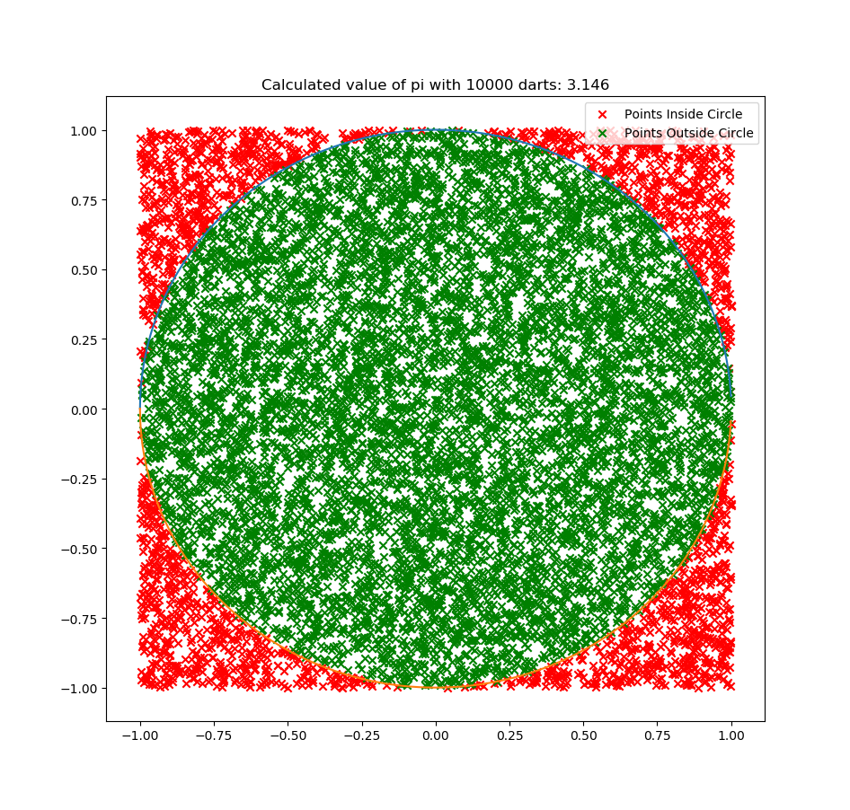
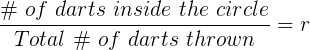
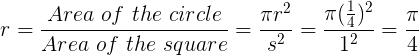
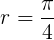
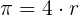

# Calculating_pi_with_Darts
This is a python script that calculates an approximation of pi using Monte Carlo's "dart" method.
To learn more about this method, watch:
https://www.youtube.com/watch?v=M34TO71SKGk

The script starts by asking you how many darts you would like to throw. Enter your desired amount (the bigger the better). Then, the program will generate the desired amount of random points (which are the darts) and plot them similar the following visual:
# 

pi is calculated by first find the ratio r, which is the amount of darts in the circle divided by the number of darts outside the circle.
## 
 The ratio r is proportional to the area of the circle divided by the area of the square.
## 
 Since the circle being used is a unit circle, and the square's sides have a length of 1, that ratio is equal to pi/4. Therefore, our calculated approximation of pi is equal to the ratio r*4.
## 
## 


## Getting Started

These instructions will get you a copy of the project up and running on your local machine for development and testing purposes.

### Prerequisites

You will need python 3.6 to run along with matplotlib.

To install use the following commands:

```
pip install matplotlib
```
### Running the script
Once installing the Prerequisites, navigate to the project folder and use the following command:
```
python main.py
```
Then the program will ask how many darts you would like to throw, enter your desired amount and enjoy the plot it produces!
